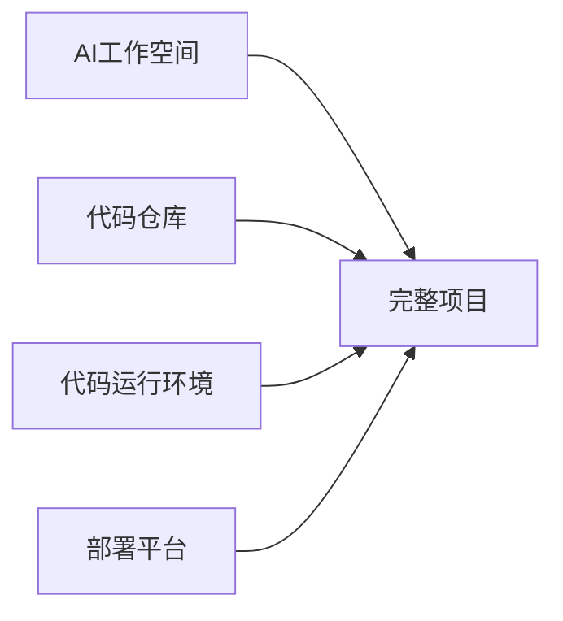
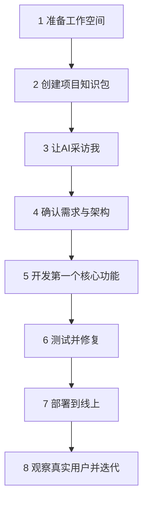

# 我从这里开始：用 AI 从 0 到 1 做出并上线一个项目

> 面向：第一次用 AI 开发正式项目的用户

这不是一篇让我“了解 AI 开发”的文章，而是一条我可以照着完成的操作路线。

我不需要先学会编程，也不需要一次读完全部知识库。我每完成一步，就会得到一个可以保存、检查和继续使用的项目成果。

## 最终我会得到什么

完成这条路线后，我应该拥有：

- 一个明确的项目目标和 V1 范围；
- 一套正式需求文档；
- 一个可以解释清楚的系统架构；
- 一个 GitHub 代码仓库；
- 至少一个完整可用的核心功能；
- 真实测试结果；
- 一个可以访问的线上版本；
- 日志、监控、回退和下一版本计划。

## 我需要准备的四样东西

| 类型 | 用途 | 新手建议 |
|---|---|---|
| AI 工作空间 | 讨论需求、设计、开发和审查 | ChatGPT Project |
| 代码仓库 | 保存代码和修改记录 | GitHub |
| 代码运行环境 | 真正运行项目和测试 | 本地 VS Code，或支持运行代码的云环境 |
| 部署平台 | 把项目发布到互联网 | 根据技术栈选择托管平台 |

AI 聊天本身不是代码运行环境。没有真实运行结果时，我只能说“代码已经生成”，不能说“功能已经完成”。

## 我的八个实战阶段

### 阶段 1：准备工作空间

我会创建 AI 项目空间、GitHub 仓库，并准备代码运行环境。

完成标志：我知道项目资料放哪里、代码放哪里、代码在哪里运行。

### 阶段 2：创建项目知识包

我会把 `05-project-template/` 中的六个文件复制到自己的项目。

完成标志：项目中存在 `PROJECT.md`、`PRD.md`、`ARCHITECTURE.md`、`PLAN_AND_STATE.md`、`DECISIONS_RISKS_EVIDENCE.md` 和 `RELEASE.md`。

### 阶段 3：让 AI 采访我

我不自己硬写专业文档。我让 AI 一次问少量关键问题，再把我的回答整理进项目文件。

完成标志：我能用一句话说明项目为谁解决什么问题，V1 做什么和不做什么。

### 阶段 4：确认需求与架构

我确认用户流程、业务规则、异常、权限、数据、成本和上线方式。

完成标志：AI 可以把每个核心需求对应到模块、接口、数据和测试。

### 阶段 5：开发第一个核心功能

我不会让 AI 一次做完整系统。我会选择一个完整的用户结果，拆成小任务逐个实施。

完成标志：真实环境中可以完成一个端到端用户流程。

### 阶段 6：测试并修复

我检查正常流程、失败流程、权限、重复操作、外部服务和旧功能回归。

完成标志：验收标准有真实测试证据，而不是只有 AI 的文字说明。

### 阶段 7：部署到线上

我准备生产配置、数据库、域名、日志、监控和回退方式，再发布。

完成标志：线上地址可以访问，核心流程在生产环境真实通过。

### 阶段 8：观察真实用户并迭代

我根据激活、留存、付费、错误率、成本和用户反馈决定下一版本。

完成标志：下一版本来自数据和真实问题，不是来自 AI 随机增加功能。

## 每一步都使用同一种学习结构

后续每篇实战文章都会告诉我：

1. **这一步完成后我会得到什么**；
2. **开始前我要准备什么**；
3. **我在界面或仓库里具体做什么**；
4. **我可以直接复制给 AI 的文字**；
5. **AI 应该返回什么格式**；
6. **我必须检查什么**；
7. **怎样才算完成**；
8. **卡住时怎样自救**。

## 我现在只做第一件事

先打开：

[`01-30分钟准备开发环境.md`](./01-30分钟准备开发环境.md)

不要先读架构、安全或多 Agent 文档。那些内容会在项目真正需要时，由 AI 按规则读取和使用。
