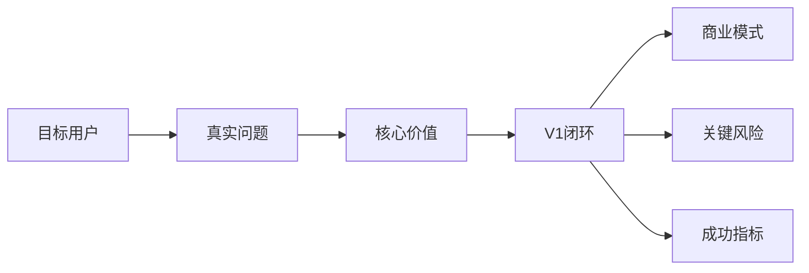

# 我如何开始一个复杂项目

> 面向：用户

当我有一个产品想法时，我最容易犯的错误，是马上让 AI 选技术栈、建数据库、写页面。

这样做通常很快能看到一个界面，但我很可能还没有想清楚：谁真的需要它、为什么愿意用、为什么愿意付费，以及 V1 到底需要完成什么。

## 一个错误的开始

我对 AI 说：

> 帮我做一个 AI 学习平台，要有登录、课程、考试、支付、证书、退款、后台、社区和排行榜。

AI 可能马上生成几十个页面和数据库表，但这些功能之间是否组成真实业务闭环，仍然不清楚。

## 我更好的开始方式

我先说：

> 我想做一个面向 AI 初学者的学习平台。用户可以免费学习，付费参加考试，通过后获得证书并退还考试费用。请先不要写代码，通过提问帮我确认目标用户、核心价值、业务闭环、风险和 V1 范围。

这时 AI 应进入 `DISCOVER` 模式，而不是 `IMPLEMENT` 模式。

## AI 应该怎样采访我

AI 最多一次问我 3～5 个真正影响项目方向的问题，例如：

1. 谁最需要这个产品？
2. 用户为什么愿意参加考试？
3. 通过后退款的商业目的是什么？
4. 谁承担退款成本？
5. 怎样防止作弊和重复领取退款？

我可以用不专业的语言回答，AI 负责把答案整理成项目定义。

## 我需要得到的第一个结果

不是代码，而是一张清楚的项目地图：



例如：

| 项目问题 | 当前答案 |
|---|---|
| 谁使用 | 想系统学习 AI，但不知道从哪里开始的普通用户 |
| 核心问题 | 内容零散，学完不知道自己是否真正掌握 |
| 核心价值 | 用结构化学习和考试证明掌握程度 |
| V1 闭环 | 注册 → 免费学习 → 付费考试 → 通过 → 证书与退款 |
| 暂时不做 | 社区、排行榜、机构版、复杂推荐算法 |
| 成功指标 | 完课率、考试购买率、通过率、退款成功率、30 日留存 |

## 我怎样判断 V1 范围是否正确

V1 不是把每个模块都做一点，而是完成一个真实价值闭环。

我会问自己：

- 用户能不能从进入产品一直走到获得结果？
- 如果没有某个功能，核心价值还能成立吗？
- 这个功能是用户需要，还是 AI 觉得“完整产品应该有”？
- 我能不能在预算和时间内真正上线并维护？

例如，社区可能有价值，但它不是“学习—考试—证书—退款”闭环的必要条件，因此可以后做。

## 我需要批准什么

在进入产品设计前，我需要明确批准：

- 一句话价值；
- 目标用户；
- V1 完整闭环；
- 必须功能；
- 明确不做的功能；
- 商业和成本假设；
- 关键风险；
- 成功指标。

这些内容由 AI 写进 `PROJECT.md`。

## 我可以直接对 AI 说

```text
现在进入 DISCOVER 模式。
请不要写代码，也不要先选技术栈。
通过少量关键问题帮我完成 PROJECT.md。
每一轮都请区分：
- 我已经确认的事实；
- 你的建议；
- 仍需验证的市场假设；
- 可能导致项目失败的风险。
当你认为信息足够时，给我一份 V1 范围建议，并明确写出不做什么，等我批准。
```

## 完成本阶段后，我应该看到

- `PROJECT.md` 不再是空模板；
- 我能向别人用一句话解释产品；
- AI 没有偷偷加入额外功能；
- 市场假设与事实已经分开；
- 我知道下一步是定义产品，而不是立刻写整个系统。
