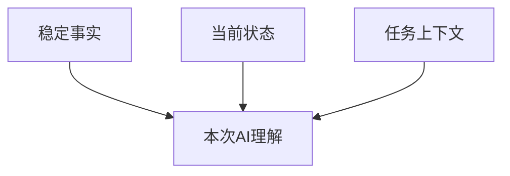

# 我如何让 AI 理解项目：扩展说明

> 面向：用户

大型项目不能依赖一段不断增长的聊天记录。我会把资料分成三部分：长期稳定的项目事实、不断变化的当前状态，以及本次任务真正需要的上下文。

稳定事实包括产品目标、正式需求、业务规则、架构边界和已批准决定。当前状态包括版本、里程碑、进行中任务、阻塞和真实验证结果。任务上下文只包含本次工作相关的需求、模块、数据、接口、文件、测试和日志。

例如，我要修复考试通过后的退款问题，不需要把课程、社区和排行榜全部交给 AI。我只提供考试、账单、退款、回调、幂等规则和相关测试。

新对话开始时，我让 AI 先读取正式项目文件，再复述当前目标、阶段、任务、允许修改范围、禁止修改范围和证据缺口。复述不准确时，我先修正上下文，不进入开发。

任务结束后，我要求把实际修改、测试结果、新风险和下一步写回正式项目文件。这样即使更换聊天、模型或平台，项目也不会重新从零开始。
