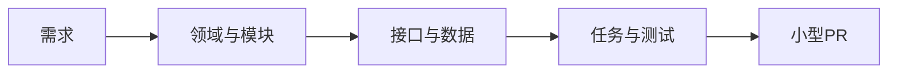

# 我如何把一个复杂功能交给 AI

> 面向：用户

复杂功能不能用一句“帮我做完”交给 AI。我会先把它变成一个有边界的任务。

## 例子：增加团队订阅功能

这个功能可能同时影响：

- 用户与组织；
- 角色和权限；
- 套餐和账单；
- 邀请成员；
- 数据隔离；
- 后台管理；
- 邮件通知；
- 数据库迁移。

如果 AI 一次修改全部内容，我很难审查，也很难回滚。

## 我先让 AI 做影响分析

我要求 AI 先列出：

- 关联需求和业务规则；
- 受影响的模块；
- 需要新增或修改的数据；
- 公共接口和兼容性；
- 权限与租户隔离；
- 测试和迁移；
- 明确不修改的范围。

## 我把大功能拆成垂直切片

团队订阅可以拆成：

1. 创建组织和组织所有者；
2. 邀请成员加入组织；
3. 为组织购买套餐；
4. 限制成员数量；
5. 取消订阅和降级；
6. 管理员查看组织账单；
7. 验证不同组织之间的数据隔离。

每一个任务都要从用户操作贯穿到接口、领域规则、数据、日志和测试，而不是先把所有页面做完，再补后端。

## 我批准的是任务契约

一个可以批准的任务应写清：

| 内容 | 示例 |
|---|---|
| 用户结果 | 组织所有者可以邀请一个成员 |
| 允许修改 | Organization、Invitation、Notification 模块 |
| 禁止修改 | Billing、登录方式、现有个人账户数据 |
| 数据影响 | 新增 invitation 表和唯一约束 |
| 完成条件 | 邀请、过期、重复邀请、无权限场景通过 |
| 回滚 | 删除新接口并回滚迁移 |

只有任务范围清楚，我才允许进入实施。

## 我控制每次改动的大小

如果 AI 发现额外问题，它应该记录为风险或后续任务，而不是顺手修改。

我也不会把功能开发、代码格式化、依赖升级和大规模重构放在同一个任务里。

## 我怎样使用不同 AI

我可以让一个 AI 负责设计任务，让另一个 AI 审查风险，再让具备仓库和终端能力的平台实施。

无论换哪个平台，正式需求、架构、任务状态和证据仍然只有一份。

## 我完成批准前的检查

- 这个任务只解决一个主要用户结果；
- 修改范围能被完整理解；
- 数据、权限和兼容性影响已经写清；
- 测试不是只有快乐路径；
- 出错时可以回滚；
- 不会和其他正在进行的任务修改同一边界。
