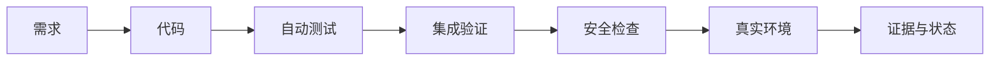

# 我如何判断 AI 真的做完了

> 面向：用户

AI 说“完成”时，我先确认它说的是哪一种完成：

```text
PROPOSED  已提出
APPROVED  已批准
GENERATED 已生成
EXECUTED  已运行
VERIFIED  已验证
RELEASED  已发布
OBSERVED  已经过生产观察
```

生成代码只能证明 `GENERATED`。只有真实运行、测试和验收都有证据，才能标记 `VERIFIED`。

## 我要求查看的证据

| 声明 | 证据 |
|---|---|
| 已修改 | Commit、PR 或 Diff |
| 可构建 | 构建命令和输出 |
| 测试通过 | 测试名称、环境和结果 |
| 权限正确 | 不同用户或租户的隔离测试 |
| 已发布 | 版本、线上地址和健康检查 |
| 生产正常 | 日志、错误率和关键业务指标 |

截图可以证明页面外观，不能单独证明权限、安全和数据正确。

## 我的检查顺序



我会确认功能满足原需求、没有无关修改、异常与权限场景已覆盖、旧接口和旧数据没有被破坏，并且项目状态已经更新。

重要功能应由新对话、不同模型、不同平台或确定性工具进行独立审查。支付、权限、数据迁移、安全和生产发布不能只由生成代码的同一个 AI 自己批准。

当没有真实证据时，我不会把任务标记为 `VERIFIED`。
