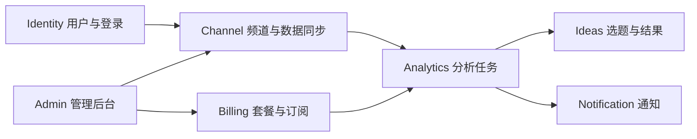

# 第 4 步：我让 AI 设计一个能够上线和继续扩展的系统

> 面向：不懂系统架构的用户

## 这一步完成后，我会得到什么

- 一份与 V1 需求对应的技术方案；
- 清楚的模块边界；
- 数据和接口设计；
- 登录、权限和用户数据隔离方案；
- 第三方服务、成本和失败处理；
- 本地、测试和生产环境方案；
- 可以被后续任务引用的 `ARCHITECTURE.md`。

## 我不需要自己选择所有技术

我可以告诉 AI 我的现实条件：

- 我是否会编程；
- 我熟悉 Python、Node.js 还是其他技术；
- 预算是多少；
- 预计用户量；
- 是否需要移动端；
- 是否需要支付、文件上传、AI、消息和后台；
- 我希望部署在哪里；
- 我能否长期维护复杂基础设施。

AI 的职责是给出少量可比较方案，而不是堆一长串流行技术。

## 第 1 个操作：创建技术架构会话

我新建：

```text
02 技术架构与生产设计
```

复制下面内容：

```text
现在进入 DESIGN 模式。

请读取已批准的 PROJECT.md、PRD.md、当前决定和风险。
本次只完成 ARCHITECTURE.md，不写业务代码，不创建数据库迁移，不部署。

请先根据我的预算、能力和 V1 范围，给出最多 3 套技术方案。
每套方案说明：
- 适合我的原因；
- 开发与维护难度；
- 初期成本；
- 支持的用户规模；
- 主要风险；
- 后续扩展方式。

在我选择方案后，再完成：
1. 系统上下文；
2. 领域与模块；
3. 数据所有权；
4. API 和后台任务；
5. 身份、授权和数据隔离；
6. 外部服务、超时、重试和成本；
7. 日志、监控和告警；
8. 本地、测试、预发布和生产环境；
9. 备份、迁移和回退；
10. 风险和待验证假设。

每个架构决定必须能追溯到需求或非功能目标。
```

## 第 2 个操作：告诉 AI 我的现实限制

示例：

```text
我的条件：
- 我是一个人开发；
- 我更熟悉 Python；
- 初期预算每月不超过 500 元；
- 预计首批 1000 个注册用户，100 个日活；
- 产品需要登录、订阅、YouTube 数据、AI 分析和管理后台；
- 我不想一开始维护 Kubernetes 或多个微服务；
- 我希望后续用户增长时可以扩展。
```

## 第 3 个操作：比较方案，不只听一个答案

AI 应该返回类似：

| 方案 | 优点 | 缺点 | 适合度 |
|---|---|---|---|
| 模块化单体 + 托管数据库 | 简单、便宜、容易维护 | 需要保持模块边界 | 推荐 |
| 多个微服务 | 可独立扩展 | 部署、监控和数据一致性复杂 | 不适合当前 V1 |
| 完全低代码 | 上线快 | 复杂业务和迁移受平台限制 | 可用于验证原型 |

我不只看“性能最好”，还看自己能否维护和承担成本。

## 第 4 个操作：确认领域和模块

一个订阅制 AI 分析工具可以先划分：



我需要确认：

- 每个模块只负责什么；
- 数据属于哪个模块；
- 模块之间通过什么接口协作；
- 是否出现一个“什么都做”的巨型模块；
- 页面名称是否被错误地当成系统模块。

## 第 5 个操作：确认权限与数据隔离

我要求 AI 明确回答：

- 用户怎样登录；
- 每个请求怎样知道当前用户；
- 用户怎样只能访问自己的频道和分析；
- 管理员权限怎样审计；
- 不同团队或租户怎样隔离；
- 前端隐藏按钮之外，服务端怎样真正阻止越权。

我可以直接说：

```text
请为每个核心对象写出所有者或租户字段，并列出读、写、删除权限。
请设计至少两组用户交叉访问测试，证明 A 用户不能访问 B 用户的数据。
```

## 第 6 个操作：确认规模和成本

我要求 AI 记录假设，而不是写“高并发、可扩展”。

例如：

| 项目 | V1 假设 |
|---|---|
| 注册用户 | 1000 |
| 日活 | 100 |
| 峰值并发 | 20 |
| 每日分析任务 | 300 |
| 单次分析 AI 成本 | 不超过 0.5 元 |
| P95 响应时间 | 普通接口低于 1 秒 |
| 分析任务完成 | 90% 在 2 分钟内 |

这些数字以后可以根据真实数据调整。

## 第 7 个操作：确认第三方服务失败时怎么办

每个外部服务都要写：

- 用途；
- 密钥存放位置；
- 超时；
- 是否重试；
- 重试是否安全；
- 限流；
- 用户看到什么；
- 服务不可用时怎样降级；
- 成本上限；
- 替代方案。

## AI 应该输出什么

`ARCHITECTURE.md` 至少包含：

- 用户规模和非功能目标；
- 系统上下文图；
- 技术栈和选择原因；
- 模块职责和数据所有权；
- 核心实体、接口和事件；
- 认证、授权和数据隔离；
- 外部服务；
- 异步任务、缓存和限流；
- 日志、指标和告警；
- 环境、部署、迁移和备份；
- 架构决定与风险。

## 我必须检查什么

- 架构是否服务于已经批准的 V1；
- 是否因为“未来大量用户”而过度复杂；
- 是否有真实权限和数据隔离方案；
- 是否考虑外部服务失败；
- 是否记录成本和容量假设；
- 是否有测试、发布和回退路径；
- 我是否有能力维护这套方案。

## 我如何批准架构

```text
我批准 ARCHITECTURE.md 版本 V1。
请将当前选定技术方案和关键取舍写入决定记录。
未验证的容量、成本和第三方能力继续标记为假设。
下一步进入实施计划，只拆任务，不一次生成整个项目。
```

## 完成检查

- [ ] 技术方案适合我的能力和预算；
- [ ] 每项核心需求有对应模块；
- [ ] 数据所有权清楚；
- [ ] 权限和租户隔离明确；
- [ ] 外部服务失败路径明确；
- [ ] 成本和规模有数字假设；
- [ ] 日志、监控、备份和回退被考虑；
- [ ] 架构已经批准并记录决定。

## 下一步

打开：

[`05-我开发第一个可用功能.md`](./05-我开发第一个可用功能.md)
