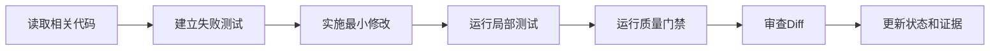

# 第 5 步：我开发第一个真正可用的功能

> 面向：第一次让 AI 修改代码的用户

## 这一步完成后，我会得到什么

- 一个明确的小任务；
- 一个独立分支或工作区；
- 一组可审查的代码修改；
- 真实运行结果；
- 与需求对应的测试；
- 更新后的项目状态和证据。

## 我先选择一个完整用户结果

我不让 AI 一次生成整个系统。

一个好的第一个功能应该：

- 对用户有明确价值；
- 范围足够小；
- 能从界面或接口一直走到数据；
- 可以独立测试；
- 出错时容易回退。

例如，频道分析产品的第一个切片可以是：

> 已登录用户输入一个公开频道地址，系统读取频道基本信息并保存到当前用户账户。

它比“完成整个频道模块”更具体，也比“只做一个输入框”更完整。

## 第 1 个操作：创建实施会话

我新建：

```text
03 实施 TASK-001 连接频道
```

然后复制：

```text
现在进入 IMPLEMENT 模式。

请先读取：
- 已批准的 PROJECT.md；
- 与本任务相关的 PRD 需求和业务规则；
- ARCHITECTURE.md 中相关模块；
- PLAN_AND_STATE.md；
- 当前代码和测试。

本次任务：<填写任务>
关联需求：<填写需求 ID>

开始修改前，请先输出任务契约：
1. 用户结果；
2. 当前行为和期望行为；
3. 允许修改的模块和文件；
4. 明确禁止修改的内容；
5. 数据、接口、权限和兼容性影响；
6. 计划新增或更新的测试；
7. 回退方式；
8. 预计修改规模。

在我批准任务契约前，不要修改代码。
```

## 第 2 个操作：检查任务契约

一个合格的任务契约可能是：

| 项目 | 内容 |
|---|---|
| 任务 ID | TASK-001 |
| 关联需求 | RQ-CHANNEL-001 |
| 用户结果 | 用户可以保存自己的公开频道 |
| 允许修改 | Channel 模块、对应 API、页面和测试 |
| 禁止修改 | Billing、订阅、管理员权限 |
| 数据影响 | 新增 channel 记录，user_id 为所有者 |
| 权限要求 | 用户只能读取自己的频道 |
| 测试 | 正常、重复、无效地址、跨用户访问 |
| 回退 | 删除新路由并回退迁移 |

我必须检查范围是否过大。如果 AI 计划同时重构登录、更新全部依赖、修改目录结构，我要求拆分。

## 第 3 个操作：让 AI 先读取现有代码

如果项目已经有代码，我要求 AI 回答：

- 当前项目怎样启动；
- 相关模块在哪里；
- 是否已有可复用逻辑；
- 当前测试怎样运行；
- 哪些接口或类型不能破坏；
- 它准备修改哪些文件。

AI 不应该只根据文件名或我的描述猜测现有代码。

## 第 4 个操作：批准实施

```text
我批准 TASK-001 的任务契约。
只允许在已声明范围内修改。
不要进行无关重构、依赖升级或格式化全仓库。
发现额外问题时记录为后续任务，不要顺手修改。
每完成一个可验证步骤就运行对应检查。
```

## 第 5 个操作：观察 AI 的实施过程

AI 应该按小步骤工作：



我不需要理解每一行代码，但我要看见：

- 修改了哪些文件；
- 为什么修改；
- 运行了哪些命令；
- 哪些检查通过；
- 哪些检查失败；
- 是否有未验证内容。

## 第 6 个操作：要求真实运行

我可以说：

```text
请在真实开发环境中执行本任务需要的安装、构建和测试命令。
请逐项提供：
- 命令；
- 退出状态；
- 关键输出；
- 失败原因；
- 是否影响任务状态。

如果当前平台没有终端能力，请明确说明，并将任务最高状态保持为 GENERATED。
```

## AI 应该输出什么

任务结束时，AI 至少给我：

1. 实际修改文件；
2. 未修改范围；
3. 关键实现说明；
4. 运行命令和真实结果；
5. 测试结果；
6. Diff 或 Commit；
7. 剩余风险；
8. 回退方式；
9. 更新后的 `PLAN_AND_STATE.md`；
10. 证据记录。

## 我必须检查什么

- 修改是否对应原需求；
- 有没有额外增加功能；
- 是否复用现有逻辑；
- 是否处理无效输入、重复操作和无权限；
- 是否有数据所有者字段；
- 是否破坏旧接口；
- 是否真正运行测试；
- 没有真实证据时，状态是否仍是 `GENERATED`。

## 一个功能何时可以进入测试阶段

- [ ] 任务契约已批准；
- [ ] 修改范围没有失控；
- [ ] 代码能构建或启动；
- [ ] 局部测试已运行；
- [ ] 没有明显密钥或安全问题；
- [ ] Diff 已经审查；
- [ ] 任务状态和证据已更新。

## 卡住时怎么办

### AI 连续修改但错误越来越多

停止继续尝试，回到最后一个可运行 Commit，让 AI 重新分析根因。

### AI 一次修改几十个文件

要求说明每个文件与任务的关系。无法解释的修改全部移出本任务。

### AI 说无法运行

确认平台是否没有终端或依赖环境。必要时把代码交给本地或云端运行环境，不接受文字模拟结果。

## 下一步

打开：

[`06-我测试并修复功能.md`](./06-我测试并修复功能.md)
