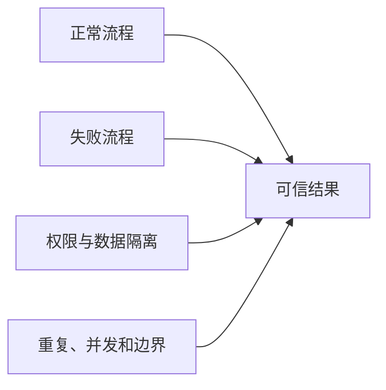

# 第 6 步：我测试并修复功能

> 面向：不知道怎样验收 AI 代码的用户

## 这一步完成后，我会得到什么

- 一份与需求对应的测试清单；
- 正常、失败、权限和边界场景的真实结果；
- 缺陷记录；
- 修复后的回归结果；
- 可以把任务标记为 `VERIFIED` 的证据，或者明确知道为什么还不能验证。

## 我不只测试“能不能点通”

功能测试至少包括：



以“连接频道”为例：

- 正确频道地址；
- 不存在的频道；
- 无效地址；
- 第三方服务超时；
- 用户重复连接；
- A 用户访问 B 用户频道；
- 数据同步中断；
- 旧版本数据兼容。

## 第 1 个操作：创建独立验证会话

我尽量不让刚刚写代码的同一个会话直接宣布自己通过。

新建：

```text
04 验证 TASK-001 连接频道
```

复制：

```text
现在进入 VERIFY 模式。

请独立读取：
- TASK-001 的需求和验收标准；
- 相关业务规则；
- 实际代码 Diff；
- 已有测试；
- 构建和运行结果。

你的任务不是继续增加功能，而是寻找不满足需求、权限错误、边界遗漏和回归风险。

请先生成测试矩阵，再执行当前环境能够执行的检查。
不得为了让测试通过而擅自改变需求或业务规则。
```

## 第 2 个操作：检查测试矩阵

AI 应该输出：

| 测试 ID | 场景 | 输入 | 预期结果 | 类型 |
|---|---|---|---|---|
| TEST-001 | 正常连接 | 有效频道地址 | 保存频道并显示信息 | 主流程 |
| TEST-002 | 无效地址 | 错误 URL | 不保存，提示格式错误 | 输入校验 |
| TEST-003 | 重复连接 | 已存在频道 | 返回已有记录，不重复创建 | 幂等 |
| TEST-004 | 跨用户读取 | B 用户请求 A 的频道 | 返回无权限 | 安全 |
| TEST-005 | 第三方超时 | 模拟超时 | 记录失败并允许重试 | 故障 |

我检查每一条是否真的对应需求和风险。

## 第 3 个操作：运行分层检查

建议顺序：

1. 格式和静态检查；
2. 构建或类型检查；
3. 单元测试；
4. 集成测试；
5. 关键端到端流程；
6. 安全和依赖检查；
7. 必要的性能或迁移检查；
8. 人工操作验证。

我要求 AI 对每一层给出真实结果，而不是一句“全部通过”。

## 第 4 个操作：记录缺陷，而不是边测边乱改

发现问题时，先记录：

```text
BUG-001
关联需求：RQ-CHANNEL-001
复现步骤：
预期结果：
实际结果：
环境和版本：
日志或截图：
严重程度：
是否阻塞发布：
```

然后创建单独修复任务。

如果一个缺陷需要修改新的模块、数据库或业务规则，就不能当成小修补顺手改完。

## 第 5 个操作：修复后做回归

AI 修复 BUG-001 后，不只重跑失败测试，还要重跑可能受影响的旧功能。

例如修改频道唯一约束后，应检查：

- 新用户第一次连接；
- 同一用户重复连接；
- 两个不同用户连接同一公开频道；
- 删除后重新连接；
- 管理后台查询。

## 第 6 个操作：确认状态

我可以问：

```text
请根据实际证据判断当前任务状态。
不要只回复“已完成”。
请列出：
- 已通过的验收标准；
- 对应测试证据；
- 未执行或失败的检查；
- 剩余风险；
- 当前允许使用的最高状态：GENERATED / EXECUTED / VERIFIED。
```

## 我必须检查什么

- 测试是否来自正式需求；
- 是否覆盖无权限和跨用户访问；
- 是否覆盖重复提交、超时和重试；
- 是否使用真实环境或可信模拟；
- 测试失败时是否先判断测试本身是否正确；
- 修复后是否做回归；
- 没有执行的测试是否明确标记。

## 完成检查

- [ ] 核心验收标准都有测试；
- [ ] 主流程通过；
- [ ] 失败和恢复流程通过；
- [ ] 权限和数据隔离通过；
- [ ] 重复和边界场景通过；
- [ ] 严重缺陷已经解决；
- [ ] 回归测试通过；
- [ ] 证据已经记录；
- [ ] 任务状态与证据一致。

## 卡住时怎么办

### AI 为了让测试通过而修改需求

立即停止，让它展示需求、测试和代码之间的冲突，由我确认哪一方应该改变。

### 测试环境和生产环境差异太大

增加预发布环境，使用接近生产的配置、数据规模和外部服务测试模式。

### 我看不懂测试输出

让 AI 把每个失败翻译成“对用户会造成什么影响”，但保留原始日志作为证据。

## 下一步

打开：

[`07-我把项目部署到线上.md`](./07-我把项目部署到线上.md)
