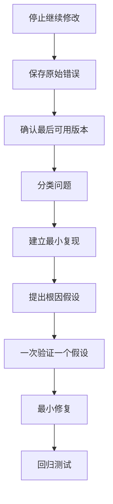

# 第 8 步：我卡住时怎样让 AI 帮我恢复，而不是越改越乱

> 面向：遇到报错、AI 反复失败或项目失控的用户

## 我先停止“继续试试”

当 AI 连续修改、错误越来越多时，我不会继续说“再试一次”。

我先做四件事：

1. 停止新的修改；
2. 保存错误日志；
3. 找到最后一个可运行版本；
4. 把问题变成一个独立诊断任务。

## 常见的五类卡点

| 类型 | 表现 | 第一动作 |
|---|---|---|
| 上下文错误 | AI 修改了不相关模块 | 重新建立最小任务上下文 |
| 环境错误 | 本地能运行，云端失败 | 比较运行时、配置和依赖 |
| 代码错误 | 构建或测试失败 | 使用最小复现和错误日志 |
| 需求冲突 | AI 不知道应该怎么工作 | 回到 PRD 和业务规则 |
| 工具权限错误 | AI 声称无法访问或写入 | 检查实际连接和权限 |

## 自救流程



## 我使用的诊断提示词

```text
现在进入 VERIFY 模式，不要继续扩大修改。

请基于以下信息诊断问题：
- 当前版本 / Commit：<填写>
- 最后正常版本：<填写>
- 执行命令：<填写>
- 完整错误日志：<粘贴>
- 预期行为：<填写>
- 实际行为：<填写>
- 最近修改：<填写>

请输出：
1. 问题属于需求、代码、依赖、配置、数据、权限、网络还是外部服务；
2. 最可能的 3 个根因，按概率排序；
3. 每个根因的最小验证方法；
4. 本轮只验证哪一个假设；
5. 不应该修改的内容；
6. 失败时怎样回到最后可用版本。

在根因没有证据前，不要进行大规模重构。
```

## 场景 1：AI 修改范围失控

表现：一个小功能修改了大量文件，还顺便升级依赖、重命名目录和重构公共代码。

我说：

```text
停止当前实施。
请列出每个修改文件与 TASK 的直接关系。
无法对应需求或完成条件的修改全部撤出本任务。
恢复到任务开始前基线，然后重新给出最小修改计划。
```

## 场景 2：错误反复出现

表现：修复 A 后出现 B，修复 B 后又出现 C。

我要求 AI 建立错误链：

- 最初错误是什么；
- 每次修改改变了什么；
- 新错误是否由前一次修改引入；
- 是否存在共同根因；
- 哪个 Commit 是最后可用状态。

必要时直接回退，重新以更小步骤实现。

## 场景 3：AI 说“应该可以”，但没有运行

我问：

```text
你当前是否具备真实终端、仓库和目标环境访问能力？
如果没有，请明确写出你只能提供 GENERATED 结果。
请给出我可以在真实环境执行的命令，以及我需要把哪些输出返回给你。
```

## 场景 4：测试和需求冲突

我不让 AI 自动修改任何一方。

我要求它展示：

- 正式需求；
- 业务规则；
- 当前测试断言；
- 当前代码行为；
- 冲突点；
- 修改每一方的影响。

由我确认正确语义后再修复。

## 场景 5：生产环境出问题

我先保护用户和数据：

1. 停止继续发布；
2. 确认影响用户和时间范围；
3. 关闭故障功能、降级或回退；
4. 保存日志和版本；
5. 修复前建立复现；
6. 修复后经过测试和重新发布流程。

事故处理中不让多个 AI 无协调地同时修改同一问题。

## 我应该保存哪些信息

每次卡点至少保存：

- 项目版本和 Commit；
- 操作时间；
- 执行命令；
- 完整原始错误；
- 环境和配置；
- 最近修改；
- 复现步骤；
- 临时处理；
- 最终根因；
- 防止再次发生的任务。

## 我什么时候需要专业人员

下面情况不能只依靠普通用户和 AI 自己判断：

- 生产数据丢失或损坏；
- 支付金额、退款或账单错误；
- 用户隐私泄露；
- 权限绕过和跨租户访问；
- 法律、税务、医疗或金融合规；
- 无法恢复的数据库迁移；
- 大规模生产事故。

AI 可以协助整理证据和方案，但不能替代责任人和专业审查。

## 自救完成检查

- [ ] 已停止无边界修改；
- [ ] 已保存原始错误；
- [ ] 已确认最后可用版本；
- [ ] 已建立最小复现；
- [ ] 根因有证据支持；
- [ ] 修复范围足够小；
- [ ] 修复后已回归测试；
- [ ] 项目状态、风险和证据已更新。

## 我已经完成新手主线

接下来我可以使用：

- [`workbook/新手项目工作表.md`](./workbook/新手项目工作表.md)：边做边填写；
- [`prompts/新手提示词包.md`](./prompts/新手提示词包.md)：直接复制常用提示词；
- [`cases/CASE-01-订阅制AI工具.md`](./cases/CASE-01-订阅制AI工具.md)：查看完整案例。
