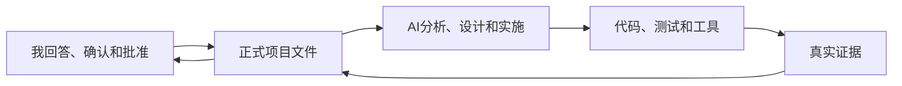

# 新手实战区：我怎样用 AI 从 0 到 1 开发并上线项目

> 面向：普通用户

这里不要求我先理解全部软件工程概念。我会通过一套连续实战课程，边做边完成自己的项目。

## 主线课程

| 顺序 | 文章 | 我会完成什么 |
|---|---|---|
| 0 | `00-新手实战总路线.md` | 看懂从想法到上线的完整路径 |
| 1 | `01-30分钟准备开发环境.md` | 建立 AI 工作空间、GitHub 和运行环境 |
| 2 | `02-我创建第一个项目会话.md` | 让 AI 正确接手项目并填写 PROJECT.md |
| 3 | `03-我把想法变成可开发需求.md` | 完成角色、流程、规则和验收标准 |
| 4 | `04-我让AI设计可上线的系统.md` | 选择技术方案并完成生产级架构 |
| 5 | `05-我开发第一个可用功能.md` | 创建任务契约并实施第一个端到端功能 |
| 6 | `06-我测试并修复功能.md` | 建立测试矩阵、修复缺陷并记录证据 |
| 7 | `07-我把项目部署到线上.md` | 完成预发布、生产发布和线上验证 |
| 8 | `08-我卡住时怎样让AI自救.md` | 在错误、失控和事故中恢复安全状态 |

## 边做边用

- `workbook/新手项目工作表.md`：我填写项目答案、任务和发布状态；
- `prompts/新手提示词包.md`：我按当前阶段复制提示词；
- `cases/CASE-01-订阅制AI工具.md`：我查看一个完整市场化项目案例。

## 每篇实战文章的结构

```text
完成后得到什么
→ 开始前准备什么
→ 在哪里操作
→ 具体做什么
→ 复制什么给 AI
→ AI 应该返回什么
→ 我检查什么
→ 怎样算完成
→ 卡住时怎么办
```

如果文章只有概念说明，却没有这些内容，它不属于主线实战课程。

## 我与 AI 的合作方式



我不需要用专业术语描述需求。AI 必须把我的自然语言转换成结构化项目内容，再让我确认。

AI 不应该一次把整个项目做完，而应该每次引导我完成一个可以观察和检查的结果。

## 补充概念文章

以下旧文章作为补充阅读保留，不是新手主线：

- `01-我如何开始一个复杂项目.md`
- `02-我如何让AI理解项目.md`
- `02-我如何让AI理解项目-扩展说明.md`
- `03-我如何把复杂功能交给AI.md`
- `04-我如何判断AI真的做完了.md`
- `05-我如何准备正式发布.md`

它们用于解释某个概念，但真正开始项目时优先按 0～8 的实战课程操作。

## 正式项目事实放在哪里

用户教程和案例不代表我的项目需求。

我的正式项目事实只写入：

- `PROJECT.md`
- `PRD.md`
- `ARCHITECTURE.md`
- `PLAN_AND_STATE.md`
- `DECISIONS_RISKS_EVIDENCE.md`
- `RELEASE.md`

当前代码、测试结果和生产状态也属于正式事实来源。
