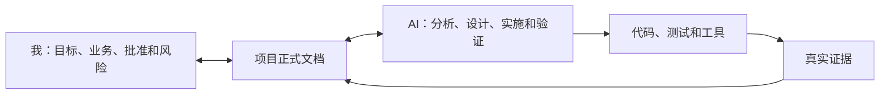

# 我怎样与 AI 一起开发复杂项目

> 面向：用户

这里的文章不是工程规范，而是帮助我理解工程规范怎样为我服务。

我不需要背下所有术语。我只需要知道：在每个阶段，我应该告诉 AI 什么、检查什么、批准什么，以及怎样防止 AI 把“看起来完成”当成“真的完成”。

## 阅读顺序

| 顺序 | 文章 | 我会学到什么 |
|---|---|---|
| 1 | `01-我如何开始一个复杂项目.md` | 怎样从模糊想法开始，而不是直接写代码 |
| 2 | `02-我如何让AI真正理解项目.md` | 怎样建立不会随着聊天变长而丢失的项目上下文 |
| 3 | `03-我如何把一个复杂功能交给AI.md` | 怎样把大功能拆成可控、可验证的小任务 |
| 4 | `04-我如何判断AI真的做完了.md` | 怎样识别“已生成”和“已验证”的区别 |
| 5 | `05-我如何把项目上线并面对真实用户.md` | 怎样从本地演示走向生产环境 |
| 6 | `cases/CASE-01-订阅制AI工具.md` | 看一个复杂项目怎样完整使用本知识库 |

## 我与 AI 的关系

我不会把全部责任交给 AI，AI 也不应该要求我先成为专业工程师。

我负责回答业务问题、作出关键选择和批准风险；AI 负责把这些内容转换成结构化需求、架构、任务和验证步骤。

## 文章与正式文档的区别

文章中的案例是为了让我看懂，不能直接当作项目要求。

当我作出真实选择后，AI 必须把结论写入：

- `PROJECT.md`
- `PRD.md`
- `ARCHITECTURE.md`
- `PLAN_AND_STATE.md`
- `DECISIONS_RISKS_EVIDENCE.md`
- `RELEASE.md`

只有这些项目文件、当前代码和真实测试结果，才代表项目现在是什么状态。
