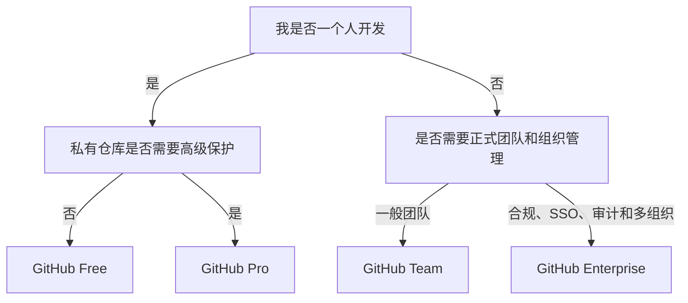

# GitHub 免费版与付费版怎样选择

> 面向：个人开发者、一人公司和小团队

最后核验日期：`2026-07-07`

GitHub 套餐分成两条路线：

- **个人账户**：GitHub Free、GitHub Pro；
- **组织账户**：GitHub Free for organizations、GitHub Team、GitHub Enterprise。

GitHub Copilot、Advanced Security、Codespaces 超额用量等可能另外收费，不应把它们和基础仓库套餐混为一谈。

## 当前主要套餐

| 套餐 | 适合谁 | 当前官方价格参考 | 主要特点 |
|---|---|---:|---|
| GitHub Free | 个人、开源项目、一人开发起步 | $0 | 无限公共和私有仓库，基础协作和安全功能 |
| GitHub Pro | 需要个人私有仓库高级功能的开发者 | $4/月 | 私有仓库高级审查、保护、Insights，更多 Actions/Codespaces 配额 |
| GitHub Free for organizations | 免费小团队或组织 | $0 | 无限仓库、团队访问控制，私有仓库部分高级功能受限 |
| GitHub Team | 正式团队和商业项目 | $4/用户/月（官方页面当前展示前 12 个月价格） | 私有仓库高级规则、审查、Code Owners、更多配额和支持 |
| GitHub Enterprise | 大型企业、合规和集中身份管理 | 起价 $21/用户/月（官方页面当前展示前 12 个月价格） | SAML、SCIM、审计、企业策略、数据驻留和大额配额 |

价格可能因地区、税费、促销、计费周期和官方调整而变化。付费前以 GitHub Pricing 页面实际结算价格为准。

## GitHub Free 能做什么

对于大多数一人开发项目，Free 已经可以完成：

- 无限公共仓库；
- 无限私有仓库；
- 公共仓库完整协作能力；
- 私有仓库基础协作；
- Issues 和 Projects；
- Pull Request；
- Dependabot alerts；
- 2,000 GitHub Actions 分钟/月；
- 500 MB Packages/Actions 共享存储配额；
- 个人账户每月 120 Codespaces core hours 和 15 GB 存储；
- 公共仓库 GitHub Pages；
- 基础社区支持。

公开仓库的 Actions 通常不消耗包含分钟，但存储和其他按量产品仍应查看当前计费规则。

## GitHub Pro 增加什么

GitHub Pro 面向个人账户，不等同于 Team。

它主要增加：

- 3,000 Actions 分钟/月；
- 2 GB Packages 存储；
- 180 Codespaces core hours/月；
- 20 GB Codespaces 存储/月；
- 私有仓库中的 Required reviewers；
- Multiple reviewers；
- Protected branches；
- Code owners；
- GitHub Pages 和 Wikis 的更多私有仓库能力；
- 私有仓库高级 Insights；
- 邮件支持。

适合：我只有一个个人账户，但希望私有商业项目拥有更完整的分支保护和审查能力。

## GitHub Team 增加什么

Team 面向 Organization，适合多人协作或把商业资产与个人账户分开。

主要价值：

- 组织级成员和团队管理；
- 私有仓库高级审查工具；
- Repository rules；
- Required reviewers；
- Multiple reviewers；
- Code Owners；
- Draft Pull Requests；
- 环境部署分支和 Secrets 控制；
- 3,000 Actions 分钟/月；
- 2 GB Packages 存储；
- Web 支持；
- 可以购买 GitHub Code Security 和 Secret Protection 等附加产品。

## GitHub Enterprise 增加什么

Enterprise 用于更高安全、身份、审计和合规要求，例如：

- Enterprise Managed Users；
- SAML SSO；
- SCIM 用户自动配置；
- 多组织集中管理；
- 更高级的 Repository rules；
- Environment protection rules；
- Audit Log API；
- 高级审计；
- 数据驻留；
- 50,000 Actions 分钟/月；
- 50 GB Packages 存储；
- 企业支持和可选 Premium Support。

普通一人公司通常不需要 Enterprise。

## 我怎样选择

## 对一人公司的建议

### 阶段 1：验证项目

使用 GitHub Free：

- 私有仓库；
- Issues；
- 基础 PR；
- Actions；
- Dependabot。

### 阶段 2：项目开始商业化

根据实际需要选择：

- 仍然只有我一个人：考虑 Pro；
- 开始招聘、外包或多 Agent/多人协作：建立 Organization，考虑 Team；
- 不要只为了“看起来专业”提前购买 Enterprise。

## 容易产生额外费用的项目

即使基础套餐免费，也可能因为以下项目收费：

- Actions 超出包含分钟；
- Actions artifacts、Packages 超出存储；
- Codespaces 计算和存储；
- Git LFS 超出配额；
- Copilot 付费套餐；
- Advanced Security 附加产品；
- 其他按量计费产品。

我应在 Billing 中设置预算和告警，避免 AI 或自动化重复运行造成意外费用。

## 我的选择检查表

- [ ] 我知道自己使用个人账户还是 Organization；
- [ ] 我知道仓库是 Public 还是 Private；
- [ ] 我知道是否需要私有仓库高级分支保护；
- [ ] 我知道 Actions、Codespaces 和 Packages 有用量限制；
- [ ] 我已设置预算和用量告警；
- [ ] 我没有把 Copilot 费用误认为基础 GitHub 套餐费用。

## 官方信息

具体套餐和用量表见本目录 `REFERENCES.md`。价格与配额会变化，使用前必须再次核对官方页面。
