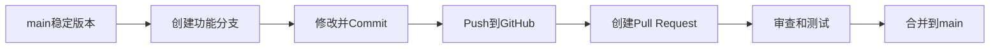

# 分支、Commit、Pull Request 与合并

> 面向：希望安全开发功能的用户

## 标准流程



## 为什么不直接改 main

`main` 应代表稳定版本。直接修改会导致变更缺少审查、任务互相干扰，也更难恢复。

## 分支命名

```text
feature/user-login
fix/refund-idempotency
docs/github-handbook
refactor/billing-service
chore/update-dependencies
```

一个分支只解决一个主要任务。

## Commit

Commit 是一次带说明的版本快照。推荐消息：

```text
feat: add channel connection flow
fix: prevent duplicate refunds
docs: add GitHub workflow guide
test: cover tenant isolation
```

好的 Commit 应目标单一、可以解释，不混入无关重构和全仓库格式化。

## Pull Request

PR 用于提议、审查和合并代码。它应说明：

- 为什么修改；
- 关联哪个 Issue 或任务；
- 实际修改和未修改内容；
- 测试结果；
- 数据与接口影响；
- 风险和回退方式。

## PR 模板

```markdown
## 目标

## 关联任务
Closes #123

## 修改内容

## 未修改内容

## 测试
- [ ] 构建
- [ ] 单元测试
- [ ] 集成测试
- [ ] 权限检查

## 风险与回退
```

## Draft PR

功能未完成、需要提前讨论或只想先运行 CI 时，可以创建 Draft PR。准备正式审查后再标记 Ready for review。

## Code Review 检查

- 是否满足原需求；
- 是否扩大修改范围；
- 是否复用现有逻辑；
- 是否影响接口和数据兼容；
- 是否覆盖无权限和失败流程；
- 测试是否充分；
- 是否存在敏感信息；
- 是否可以回退。

## 合并方式

| 方式 | 特点 | 适合情况 |
|---|---|---|
| Merge commit | 保留分支所有 Commit，并增加合并 Commit | 需要完整分支历史 |
| Squash and merge | 整个 PR 压成一个 Commit | 一人开发、保持 main 简洁 |
| Rebase and merge | 形成线性历史 | 团队熟悉 rebase |

## 合并前门禁

- [ ] PR 已关联任务；
- [ ] Diff 范围可审查；
- [ ] 必要 Review 已通过；
- [ ] 自动检查通过；
- [ ] 冲突已解决；
- [ ] 迁移和回退清楚；
- [ ] 不包含密钥；
- [ ] PR 不是 Draft。

## 分支保护和 Rulesets

可以设置：

- 必须通过 PR 合并；
- 必须通过指定检查；
- 必须解决 Review 讨论；
- 必须由 Code Owner 批准；
- 限制谁能修改受保护分支；
- 禁止删除受保护分支。

私有仓库可用的高级规则与当前套餐有关。

## 冲突

当多个分支修改同一位置时，Git 可能无法自动合并。解决冲突时必须理解双方修改目的，不能机械保留某一边。

## 一人开发也建议使用 PR

PR 能提供修改摘要、自动测试、AI 独立审查和清晰证据。一个人也可以用新会话审查自己的 PR。

## 完成检查

- [ ] main 不直接开发；
- [ ] 一个分支对应一个任务；
- [ ] Commit 小而清楚；
- [ ] PR 有目标、测试和风险；
- [ ] 合并前门禁通过；
- [ ] 项目状态记录了 PR 和 Commit。
