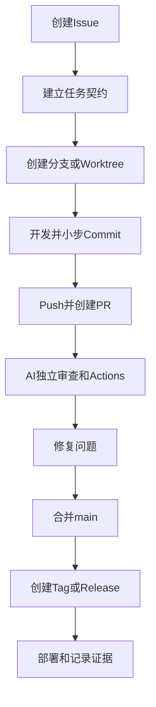

# 一人开发的 GitHub 标准工作流

> 面向：一人公司、个人开发者和使用多个 AI 的用户

## 我的默认流程



## 1. 从 Issue 开始

即使只有我一个人，也先创建 Issue，至少写：

- 用户结果；
- 范围；
- 明确不做；
- 验收标准；
- 风险；
- 关联需求 ID。

## 2. 同步 main

```bash
git switch main
git fetch origin
git pull --ff-only
```

确认工作目录干净：

```bash
git status
```

## 3. 创建分支

```bash
git switch -c feature/<任务名>
```

复杂或并行任务使用 Worktree：

```bash
git worktree add ../project-task -b task/<编号> main
```

## 4. 开发前保存基线

记录：

- 当前 Commit；
- 当前分支；
- 任务 ID；
- 要运行的测试；
- 禁止修改范围。

## 5. 小步修改和 Commit

每完成一个可解释步骤：

```bash
git status
git diff
git add -p
git commit -m "feat: complete one clear step"
```

不要等 AI 修改几十个文件后才第一次 Commit。

## 6. Push 并创建 PR

```bash
git push -u origin feature/<任务名>
```

然后在 GitHub 创建 PR，关联 Issue，并填写测试和风险。

## 7. 独立审查

可以使用：

- 新 ChatGPT 会话；
- Claude Code 或 Cursor 的 Review；
- GitHub Copilot review；
- 静态检查和 Actions；
- 人工查看 Diff。

审查者不应继续扩展需求，只检查当前 PR。

## 8. 修复审查问题

在原分支修改并继续 Push，PR 会自动更新。

每个 Review 意见应：

- 已修复；
- 明确解释不修改原因；
- 转为后续 Issue；
- 或由用户作出正式决定。

## 9. 合并

一人开发通常使用 Squash and merge，让 main 每个 PR 对应一个清晰 Commit。

合并后：

```bash
git switch main
git pull --ff-only
git branch -d feature/<任务名>
```

远程分支可以在 GitHub 自动删除。

## 10. 发布

正式版本：

```bash
git tag -a v1.0.0 -m "Release v1.0.0"
git push origin v1.0.0
```

通过 Release 和 Actions 生成发布说明、构建产物和部署记录。

## 11. 更新项目事实

任务结束后更新：

- `PLAN_AND_STATE.md`：任务状态、分支、Commit、PR；
- `DECISIONS_RISKS_EVIDENCE.md`：决定、风险、测试和发布证据；
- `RELEASE.md`：版本、部署和观察结果。

## 推荐分支策略

一人项目不需要复杂 Git Flow。通常使用：

```text
main
├─ feature/*
├─ fix/*
├─ docs/*
└─ chore/*
```

只有确实需要维护多个生产版本时，再增加长期 release 分支。

## 每日结束前

- [ ] 工作区状态已检查；
- [ ] 有价值修改已 Commit；
- [ ] 分支已 Push；
- [ ] 未完成内容有清晰状态；
- [ ] 没有未提交密钥；
- [ ] 下一任务已记录；
- [ ] main 仍保持稳定。
