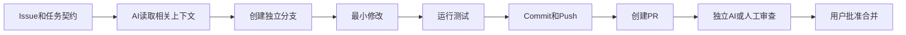

# AI 与 GitHub 协作工作流

> 面向：使用 ChatGPT、Claude Code、Cursor、Copilot 或其他 AI 修改代码的用户

## AI 不应该直接得到无限权限

我先确认 AI 当前能做什么：

- 只能阅读代码；
- 可以创建分支；
- 可以修改文件；
- 可以运行终端；
- 可以创建 Commit；
- 可以 Push；
- 可以创建 PR；
- 可以合并；
- 可以部署。

权限越高，确认要求越高。

## 推荐任务流程



## 开始任务前我要求 AI 输出

```text
当前仓库和分支
关联 Issue / 需求
允许修改的目录和文件
禁止修改的范围
预计文件 footprint
需要运行的测试
回退方式
当前工具权限
```

没有任务契约时，不允许大规模修改。

## 一个 AI 任务一个分支

推荐：

```text
ai/task-001-channel-connect
ai/task-002-billing-webhook
ai/review-task-001
```

不同 AI 可以并行，但必须：

- 分支或 Worktree 隔离；
- 模块所有权不冲突；
- 公共接口先确认；
- 一个集成人负责合并；
- 每次合并后运行完整检查。

## AI 创建 Commit 的要求

AI 必须先展示：

- `git status`；
- `git diff`；
- 暂存文件列表；
- Commit message；
- 是否存在未追踪或敏感文件。

Commit 完成后返回 Commit SHA。

## AI 创建 PR 的要求

PR 至少写明：

- 目标和关联 Issue；
- 修改与未修改内容；
- 测试命令和结果；
- 数据、权限和接口影响；
- 风险和回退；
- 当前可信状态。

## AI 不得声称完成的情况

- 没有真实 Commit SHA，却说已经提交；
- 没有 Push 结果，却说 GitHub 已更新；
- 没有 PR 地址，却说 PR 已创建；
- 没有测试输出，却说检查通过；
- 没有合并结果，却说已经进入 main；
- 没有部署结果，却说已经上线。

## 独立审查

生成代码的 AI 不应独自批准自己的高风险修改。

可以让另一个会话或平台检查：

- 需求覆盖；
- Diff 范围；
- 重复逻辑；
- 权限和租户；
- 数据迁移；
- 测试遗漏；
- 安全与密钥；
- 回退能力。

## 给 AI 的任务提示词

```text
请先读取当前 Issue、项目正式文件和相关代码。
在修改前输出任务契约、影响分析和预计文件列表。
只在独立分支中工作，不直接修改 main。
每次 Commit 前展示 status 和 diff。
完成后运行已批准的测试，创建 PR，并返回真实 Commit SHA、PR 地址、测试结果和剩余风险。
没有工具结果时，不得声称操作成功。
```

## 高风险操作必须再次确认

- 合并到 main；
- 删除分支或文件；
- 改写共享历史；
- 处理 Git 历史中的密钥；
- 修改 Actions 生产部署；
- 修改权限和 Rulesets；
- 发布 Release；
- 执行生产迁移。

## AI 协作检查

- [ ] AI 权限符合当前任务；
- [ ] 任务有独立分支；
- [ ] 修改范围已批准；
- [ ] Commit 前看过 Diff；
- [ ] 测试有真实输出；
- [ ] PR 有风险和回退；
- [ ] 高风险修改经过独立审查；
- [ ] 项目状态记录了 Commit 和 PR。
