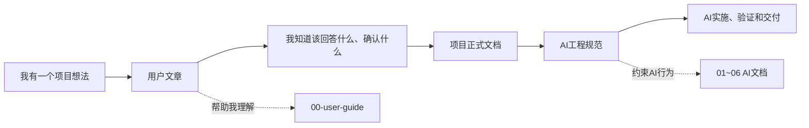

# AI Dev KB

> 面向：普通用户与 AI

## 我为什么建立这个知识库

我希望自己即使不是专业程序员，也能借助 ChatGPT、Claude Code、Cursor 等 AI，把一个想法逐步做成能够服务真实用户的正式产品。

我不只是想让 AI 帮我写几段代码。我希望它能陪我完成：

```text
想法
→ 市场与用户判断
→ 产品需求
→ 系统架构
→ 功能开发
→ 测试与安全检查
→ 部署上线
→ 监控、运营和持续迭代
```

AI 很擅长快速生成内容，但大型项目真正困难的地方是：AI 会忘记项目背景、误解需求、擅自扩大修改范围、破坏原有架构，或者在没有真实测试时告诉我“已经完成”。

因此，这个知识库不是提示词合集，而是一套让我和 AI 都知道“现在处于什么阶段、应该做什么、什么不能做、怎样才算真的完成”的项目工作系统。

## 我应该从哪里开始

第一次使用时，我只需要先读：

1. [`USER_START.md`](./USER_START.md)：告诉我怎样使用整个知识库。
2. [`00-user-guide/`](./00-user-guide/)：用第一人称、案例和流程图解释我怎样与 AI 合作。
3. 当我真正启动项目时，复制 [`05-project-template/`](./05-project-template/) 中的六个项目文件。

AI 开始工作时必须先读：

1. [`AI_START.md`](./AI_START.md)
2. [`AI_DOCS.md`](./AI_DOCS.md)
3. 当前 AI 平台的适配器，例如 [`06-platforms/chatgpt-web/README.md`](./06-platforms/chatgpt-web/README.md)
4. 当前项目的正式项目文件

## 文档分成两条路线



### 用户需要看的文章

放在 `00-user-guide/`。

这些文章使用“我”的角度，主要帮助我：

- 把模糊想法表达给 AI；
- 知道 AI 需要哪些信息；
- 学会批准需求、架构和任务；
- 判断 AI 是只生成了代码，还是已经真实验证；
- 用案例理解复杂项目如何被拆解。

用户文章可以使用比喻、示例、图表和故事，但它们不是正式项目事实。

### AI 需要看的文档

主要是：

- `AI_START.md`
- `AI_DOCS.md`
- `01-ai-collaboration/`
- `02-product-definition/`
- `03-system-design/`
- `04-delivery/`
- `06-platforms/`

这些文档必须保持结构明确、术语一致、状态可追踪、规则可执行。AI 不应把用户文章中的例子误认为当前项目需求。

### 我和 AI 共同维护的项目文件

放在 `05-project-template/`，复制到具体项目后使用：

- `PROJECT.md`：项目、市场、用户和范围
- `PRD.md`：需求、角色、业务规则和验收标准
- `ARCHITECTURE.md`：领域、模块、数据、接口、安全和规模
- `PLAN_AND_STATE.md`：任务、进度、分支和当前状态
- `DECISIONS_RISKS_EVIDENCE.md`：决定、风险、假设和真实证据
- `RELEASE.md`：环境、部署、监控和回滚

## 当前目录

```text
ai-dev-kb/
├─ README.md
├─ USER_START.md
├─ AI_START.md
├─ AI_DOCS.md
├─ 00-user-guide/           # 我需要看的文章和案例
├─ 00-research/             # 调研结论与来源
├─ 01-ai-collaboration/     # AI协作、上下文、任务和变更规则
├─ 02-product-definition/   # 产品、PRD、领域和需求追踪
├─ 03-system-design/        # 架构、安全、可靠性和成本
├─ 04-delivery/             # 实施、质量、发布和生产运维
├─ 05-project-template/     # 每个项目的正式知识包
└─ 06-platforms/            # 不同AI平台的适配方式
```

## 一个最重要的原则

我可以用自然语言表达需求，但我不能只对 AI 说“帮我把整个项目做完”。

我需要和 AI 一起把复杂项目转换成：

```text
明确目标
+ 已批准范围
+ 可追踪需求
+ 架构边界
+ 小型任务
+ 真实验证
+ 可回滚发布
```

AI 可以提高我的执行能力，但最终上线的是软件，不是 AI 的回答。

## 版本

当前版本：`V1.2 User / AI Split`  
更新日期：`2026-07-07`

调研结论与来源见 [`00-research/FINDINGS.md`](./00-research/FINDINGS.md) 和 [`00-research/REFERENCES.md`](./00-research/REFERENCES.md)。
