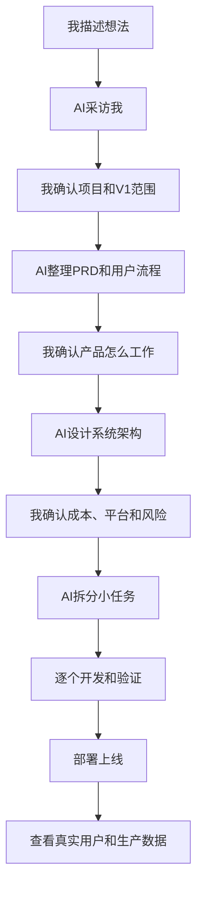

# 我怎样开始使用 AI Dev KB

> 面向：用户

我第一次打开这个知识库时，不需要把所有文件都读完。我只需要先理解一件事：

> 我负责告诉 AI 我想解决什么问题、批准哪些决定；AI 负责把这些信息整理成专业项目文档，并在规则范围内推进开发。

## 我从一个想法开始

假设我说：

> 我想做一个可以帮助内容创作者自动分析 YouTube 频道，并给出选题建议的订阅制网站。

这句话足够开始，但不够直接开发。AI 接下来应该帮助我确认：

- 谁会使用；
- 用户最痛的问题是什么；
- 用户为什么愿意付费；
- V1 只解决哪一个完整问题；
- 是否需要登录、支付、数据采集和后台；
- 上线后怎样判断产品有价值。

我不需要提前懂 PRD、领域模型或系统架构。AI 会把我的回答写入项目文档，我只需要检查它有没有准确表达我的意思。

## 我的使用路线



## 我需要维护的六个文件

我启动一个新项目时，从 `05-project-template/` 复制六个文件：

| 文件 | 我主要确认什么 | AI 主要维护什么 |
|---|---|---|
| `PROJECT.md` | 我为什么做、给谁用、V1 做什么 | 市场假设、范围和指标 |
| `PRD.md` | 产品流程是否符合我的想法 | 需求、业务规则、状态和验收标准 |
| `ARCHITECTURE.md` | 成本、平台和风险是否可接受 | 模块、数据、接口、安全和规模 |
| `PLAN_AND_STATE.md` | 当前到底在做什么 | 任务契约、进度、分支和阻塞 |
| `DECISIONS_RISKS_EVIDENCE.md` | 哪些决定由我批准 | 决定原因、风险和验证证据 |
| `RELEASE.md` | 是否允许上线 | 部署、迁移、监控和回滚步骤 |

## 每次开始一个新对话，我怎么说

我可以直接复制下面这段：

```text
请先读取 AI_START.md、当前平台适配器，以及本项目的六个正式项目文件。
先告诉我：
1. 你理解的项目目标；
2. 当前阶段和当前任务；
3. 哪些内容已经确认；
4. 哪些信息存在冲突或缺失；
5. 本次你准备做什么、不会做什么；
6. 怎样验证完成。
在我确认前，不要修改代码或项目状态。
```

## 我怎样判断 AI 有没有理解

AI 应该能够准确回答：

- 这个项目为谁解决什么问题；
- V1 明确做什么和不做什么；
- 当前任务关联哪项需求；
- 可能影响哪些模块、数据和用户；
- 哪些决定不能被擅自推翻；
- 最后用什么证据判断完成。

只要其中一项说错，我就先纠正上下文，不急着让 AI 写代码。

## 我怎样批准一个任务

我不只说“可以，开始吧”。我确认下面五点：

1. 目标正确；
2. 修改范围足够小；
3. 没有顺便增加新功能；
4. 测试和验收方法清楚；
5. 出问题时可以回滚。

然后我可以说：

```text
我批准 TASK-012。只允许修改 Billing 模块和对应测试，不修改用户权限模型。完成后必须运行单元测试、支付集成测试，并提供真实结果。
```

## 我最容易犯的错误

- 一次要求 AI 做完整项目；
- 把聊天记录当作唯一项目文档；
- 看见页面能打开，就认为产品完成；
- AI 说“测试通过”，但没有真实输出；
- 在一个长聊天里混合需求、架构、开发和发布；
- 没有确认权限、支付、数据删除和失败流程；
- 不记录重要决定，导致不同 AI 反复推翻方案。

## 接下来读什么

1. [`00-user-guide/01-我如何开始一个复杂项目.md`](./00-user-guide/01-我如何开始一个复杂项目.md)
2. [`00-user-guide/02-我如何让AI真正理解项目.md`](./00-user-guide/02-我如何让AI真正理解项目.md)
3. [`00-user-guide/03-我如何把一个复杂功能交给AI.md`](./00-user-guide/03-我如何把一个复杂功能交给AI.md)
4. [`00-user-guide/04-我如何判断AI真的做完了.md`](./00-user-guide/04-我如何判断AI真的做完了.md)
5. [`00-user-guide/05-我如何把项目上线并面对真实用户.md`](./00-user-guide/05-我如何把项目上线并面对真实用户.md)
6. [`00-user-guide/cases/CASE-01-订阅制AI工具.md`](./00-user-guide/cases/CASE-01-订阅制AI工具.md)
